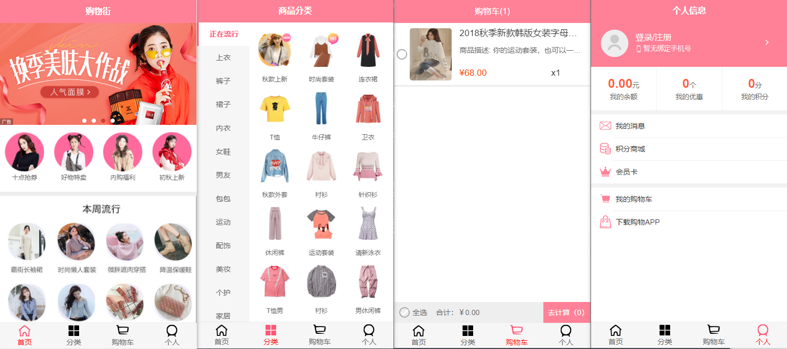

# Vue.js 开发移动端购物 WebApp

该项目是以 Vue.js （2.x）为框架，加上Vue生态全家桶而开发出的、具备基本购物APP功能的移动端购物 WebApp。



## 个人收获

- 对`Vue`开发流程有了实际的认识，业务逻辑构建/组件开发/组件复用/数据结构构建
- 对响应式更新和组件化有了更清晰的了解
- 运用了`vuex`、`vue-router`等生态组件，进一步学习状态管理和路由分配
- 对一些JS技巧（防抖节流、类封装、异步等）有了更深的理解
- 学习`axios`网络请求封装
- UI 与 用户交互的重要性

## 技术栈

#### 前端

- `Vue`：JavaScript优秀的 MVVM 框架，核心特色是**响应式数据绑定**和**组件系统**
- `vue-router`：vue为单页面应用提供的路由系统，项目上线前使用了 `Lazy Loading Routes` 技术来实现异步懒加载来优化性能
- `vuex`：Vue 集中状态管理，使得多个组件共享某些状态时更加快速简介、并且更加容易管理
- `better-scroll`：由黄轶老师开发的iscroll 优化版，使移动端滑动体验更加流畅
- `ES6`：ECMAScript 新一代语法，具备模块化、解构赋值、Promise、Class 等新特色

#### 网络

- `axios`：一个基于 promise 的 HTTP 库，可以用在浏览器和 node.js 中，支持拦截器等高级配置。

#### 自动化构建及其他辅助插件

- `vue-cli`：Vue 脚手架工具，快速初始化项目代码、起服务、自动配置打包、热更新等
- `npm`：包管理工具实现各种插件的安装与管理
- `eslint`：代码风格检查工具，规范代码格式

## 项目细节

项目主要有五个核心页面：

- 首页（Hone）
- 详情页（Detail）
- 分类页（Category）
- 购物车页（Cart）
- 个人页（Profile）

### 首页（Home）

首页上面横向轮播图

中间为一些推荐部件

下方为一个Sticky的控制Bar（封装的`TabControl`组件，可通过点击切换商品分类）以及商品列表瀑布流，包括上拉加载功能（封装的`GoodList`组件）

### 商品详情页（Detail）

点击商品列表可进入商品详情页面。

商品详情页面包括：

- 顶部的控制Bar（封装的`TabControl`组件，点击可跳转至相应部分位置）

- 商品详情图片轮播图
- 商品信息部件

- 商铺信息展示部件
- 商品效果图展示
- 商品推荐部件（复用封装的`GoodList`组件）

- 底部控制Bar（包括加入购物车提醒及其他按钮）

### 分类页（Category）

分类页分为左右两个部分：

左边是商品的一级分类，点击后右边显示相应商品二级分类

右边商品二级分类包括上方分类和下方商品列表，同样包括`TabControl`组件和`GoodList`组件

### 购物车页（Cart）

购物车页面通过读取vuex组件中的数据显示用户加入购物车的商品

可以实现一些例如全选功能、商品价格合计、商品添加/删除等基本购物车功能

### 个人页（Profile）

因为缺少相应服务器管理，所以只开发出了相应组件，并没有连接数据库管理

个人页面包括用户资产管理以及各种特权显示

## vue-mall-app

```
# clone the repo into your disk.
$ git clone https://github.com/CodeMenTORy/vue-mall-app.git

# install dependencies
$ npm install

# serve with hot reload at localhost:8080
$ npm run serve

# build for production with minification
$ npm run build
```

